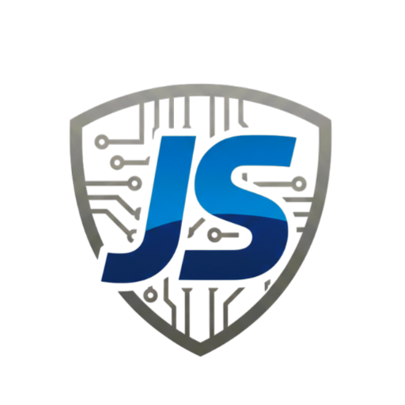

<h1 align="center">My Developer Portfolio</h1>

<!-- Banner or Logo -->
<p align="center">
  
</p>

<p align="center">
  <b>Joseph Stalin</b><br>
  Full Stack Developer | 8+ Years Experience | Vue.js & Laravel Specialist
</p>

<p align="center">
  <a href="https://iamjosephstalin.vercel.app">Portfolio</a> •
  <a href="mailto:mm93joe@gmail.com">Email</a> •
  <a href="https://github.com/iamjosephstalin">GitHub</a> •
  <a href="https://www.linkedin.com/in/iamjosephstalin">LinkedIn</a>
</p>

---

## 📝 About

Hi, I'm **Joseph Stalin** — a passionate Full Stack Developer with over 10+ years of experience, 
I specialize in building robust, scalable, and user-centric web applications using modern technologies.

- 🔭 Currently working on: Large-scale web apps, API development, UI/UX designs and making Coffee ☕
- 🏆 15+ Projects Completed | 9+ Worldwide Clients
- 💡 Focus: Transforming ideas into beautifully crafted products
- 🌍 Based in India (GMT+5:30)

---


## 🛠️ Tech Stack

| Frontend                                                                                               | Backend                                                                                             | Database                                                                             | DevOps/Cloud                                                                               | Tools & Others                                                                                      |
| ------------------------------------------------------------------------------------------------------ | --------------------------------------------------------------------------------------------------- | ------------------------------------------------------------------------------------ | ------------------------------------------------------------------------------------------ | --------------------------------------------------------------------------------------------------- |
|           |  |  |  |                 |
|  |                                                                                                     |                                                                                      |                                                                                            |              |
|                 |                                                                                                     |                                                                                      |                                                                                            |
|                    |                                                                                                     |                                                                                      |                                                                                            |  |
|                 |                                                                                                     |                                                                                      |                                                                                            |                    |

---

## 📂 Project Structure

```text
src/
  assets/        # Static assets (images, fonts)
  components/    # Vue components (Profile, Social, Card, etc.)
  composables/   # Reusable logic (useFetch, useNotification, etc.)
  config/        # JSON configs (profile, projects, tools, socials, nav, faq, experience)
  events/        # Event handlers (EventName, AnalyticsEvent)
  mocks/         # Mock data for development and testing
  router/        # Vue Router setup
  stores/        # Pinia stores
  styles/        # SCSS styles
  utils/         # Utility functions
  views/         # Main views (Home, Projects, Tools, Experience, Thoughts, Contact)
public/          # Static assets (icons, banners, manifest, sitemap)
scripts/         # Build scripts (update-sitemap.js)
```

---

## 🏗️ How to Run Locally

```bash
# Install dependencies
npm install

# Start development server (runs both Vite and mock API server)
npm run dev

# Build for production
npm run build
```

**Note**: The `dev` command runs both the Vite frontend server (port 5173) and a mock API server (port 3001) to test the contact form locally. See `LOCAL_DEVELOPMENT.md` for details.

---

## 🤝 Contact

- 📧 Email: [mm93joe@gamil.com](mailto:mm93joe@gmail.com)
- 🌐 Portfolio: [iamjosephstalin.vercel.app](https://iamjosephstalin.vercel.app)
- 💼 LinkedIn: [linkedin.com/in/iamjosephstalin](https://www.linkedin.com/in/iamjosephstalin)

---

## 📄 License

This project is open source and available under the [MIT License](LICENSE).

---

## 💖 Sponsor & Support

If you find this project useful, consider supporting me:

<p align="left">
  <a href="https://github.com/sponsors/iamjosephstalin"></a>
  <a href="https://www.buymeacoffee.com/iamjoseph"></a>
</p>

---

<p align="left">
  Developed by Joseph Stalin | Built with Vue 3 & Vite | Hosted on Vercel
</p>
